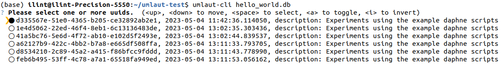
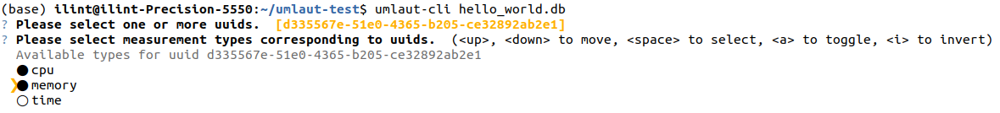
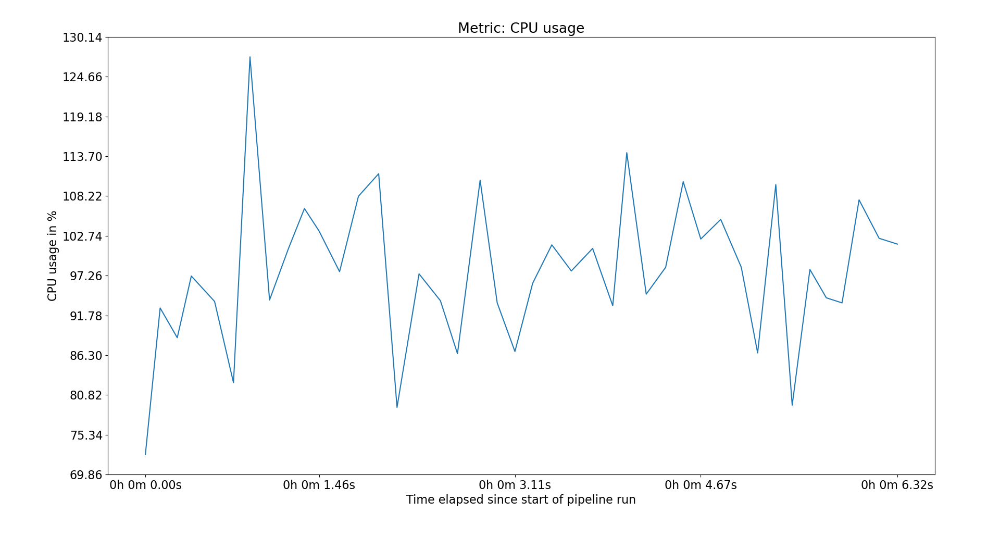
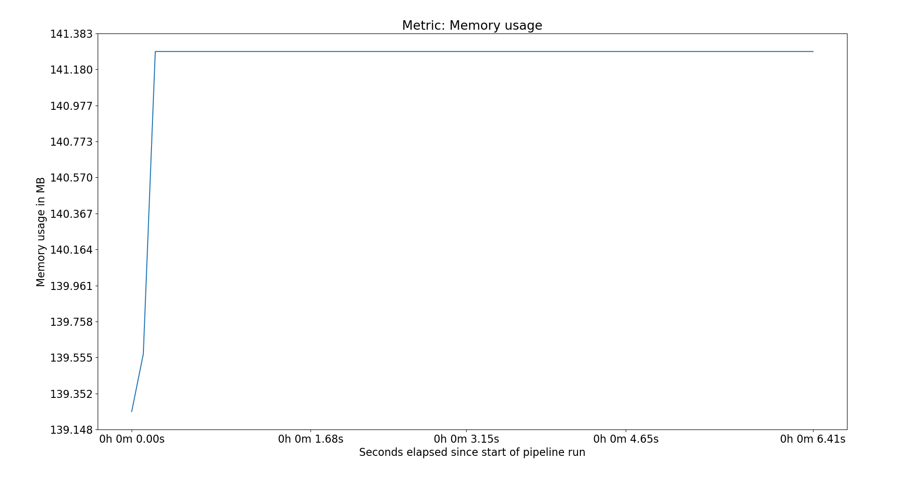
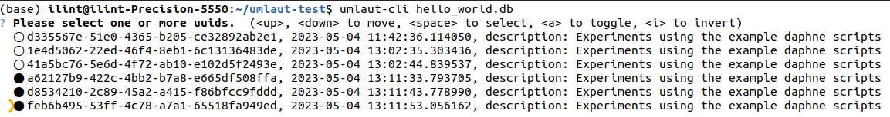
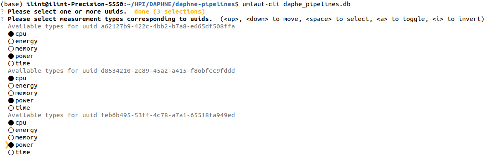
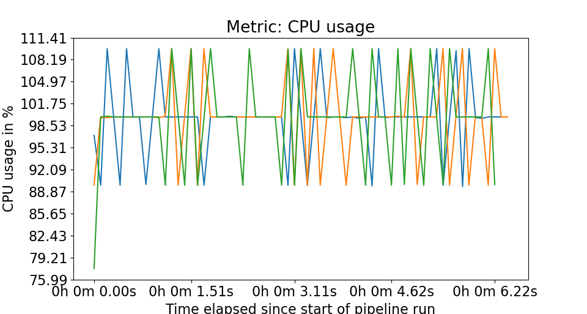
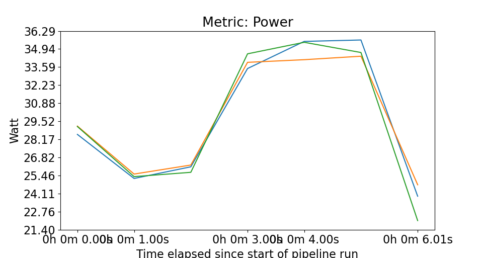

# UMLAUT (Universal Machine Learning Analysis UTility)

A modular suite for benchmarking all stages of Machine Learning pipelines. To find bottlenecks in such pipelines and compare different ML tools, this framework can calculate and visualize several metrics in the data preparation, model training, model validation and inference stages.

## Installation & Setup

Clone the current repository with the following command:

```
git clone git@github.com:hpides/End-to-end-ML-System-Benchmark.git
```
To use the package in a Python project, include it in the *requirements.txt* file.  
That can be done with a path reference to the local repository. Include the following line in your requirements file, with your local path.

```
-e <PATH_TO_REPOSITORY>/umlaut/
```

Or, through **pip**:

```
pip install -e <PATH_TO_REPOSITORY>/umlaut/
```


## System Integration

Upon installation, UMLAUT can be imported in any Python pipeline. The complete example pipeline can be found in [./pipelines/github_example/main.py](./pipelines/github_example/main.py).
To import UMLAUT, use the following *import* statement in the Python script.

``` 
import umlaut 
```

To intialize a benchmark, initialize an instance of the *Benchmark* class. It requires two string parameters, *db_file*, and *description (optional)*.
The metrics are listed in a dictionary that will then be used by the benchmark class.

``` 
import time
import numpy as np
from umlaut import Benchmark, BenchmarkSupervisor, MemoryMetric, CPUMetric
 
bm = Benchmark('sample_db_file.db', description="Database for the Github sample measurements")

bloat_metrics = {
    "memory": MemoryMetric('bloat memory', interval=0.1),
    "cpu": CPUMetric('bloat cpu', interval=0.1)
}
```

To benchmark a method, we attach a decorator (*BenchmarkSupervisor*) providing the metrics and the benchmark class. After the completion of the method, the *Benchmark* needs to be *closed*.

```
@BenchmarkSupervisor(bloat_metrics.values(), bm)
def bloat():
    a = []
    for i in range(1, 2):
        a.append(np.random.randn(*([10] * i)))
        time.sleep(5)
    print(a)

def main():
    bloat()
    bm.close()

if __name__ == "__main__":
    main()
```

## Comand Line Interface

Measurements are accessed through UMLAUT's CLI tool. It can be invoked from a *bash* terminal with the following command.

```
umlaut-cli <db_file>
```

To read through the measurements from the *sample_db_file.db* database, we insert the *db_file* name in the command.

```
cd pipelines/github_example
umlaut-cli sample_db_file.db
```

For detailed descriptions of all avaiable arguments and flags, call the *help* command for *umlaut-cli*.

```
umlaut-cli --help
```

## Metrics

UMLAUT collects measurements of the following metrics:  

* Time spent
* Memory usage
* Loss (single run and multiple runs)
* Influence of batch size and #epochs
* Influence of learning rate
* Time to Accuracy (single run and multiple runs)
* Power usage
* Multiclass Confusion Matrix
* Standard metrics as accuracy, F1, TP/TN etc.
* Latency
* Throughput

## Visualization

Through the CLI tool, the measurements for each of the metrics can be visualized. For each pipeline, users can generate plots for one or more metrics.   
Measurements for the same metric for multiple pipelines can be shown on a single plot. Examples of using the CLI toolkit for visualization are shown below. 
To reproduce the following plots, use the *[./github_example/hello_word.db](./pipelines/github_example/)*.

### Selecting single pipeline to visualize



### Selecting measurements for a single pipeline



### Results for CPU and Memory Usage [single pipeline]  



  

### Selecting multiple pipelines to visualize   

  

### Selecting measurements for multiple pipelines

  

### Results for CPU and Power Usage [multiple pipelines]  



  

## Example Pipelines
In the *pipelines* folder, there are several examples of the following pipelines where UMLAUT is integrated. 

* So2Sat Earth Observation [[description]](https://scihub.copernicus.eu/) [[umlaut pipeline]](./pipelines/so2sat_pipeline)
* Backblaze Hard Drive Anomaly Prediction [[description]](https://www.backblaze.com/b2/hard-drive-test-data.html) [[umlaut pipeline]](./pipelines/backblaze_pipeline)
* Stock Market Prediction [[description]](https://towardsdatascience.com/lstm-time-series-forecasting-predicting-stock-prices-using-an-lstm-model-6223e9644a2f) [[umlaut pipeline]](./pipelines/stock_market_pipeline)
* MNIST Digit Recognition [[description]](https://github.com/rahulagg999/MNIST-Digit-Recognizer/blob/master/MNIST.ipynb) [[umlaut pipeline]](./pipelines/MNIST_pipeline)

* Meta Benchmarking Pipeline for initial testing:
By running the provided sh files, a set of operations (sleeping, sorting, matrix multiplication) can be run to test Umlaut on your own system. Furthermore the provided python file can be run for customized testing with the following arguments:

-t / --time to activate runtime measurements\
-m / --memory to activate memory measurements\
  -mf / --memoryfreq to specify the interval for memory measurements\
-c / --cpu to activate cpu measurements\
  -cf / --cpufreq to specify the interval for cpu measurements\  
-o / --order to specify which operations to run ("sleep", "sort", "mult", "vw", in any order and as often as desired)
-r / --repeat to specify how often the set of operations should be repeated

Umlaut should have a memory overhead of ~130 MB, a CPU usage of 10-20% when idle and close to no time overhead.
When sorting, memory usage should have a mean and max of within 1000-1100 MB.
When matrix multiplying, CPU usage should have a mean of ~90%.

## Documentation
* https://hpides.github.io/End-to-end-ML-System-Benchmark/

<!-- ## How to use each decorator:
### Following Decorators only need to be applied to a method:
* Time
* Memory
* Energy

### TimeToAccuracyMult
Needs a dict returned with an entry having the key "accuracy" containing the accuracy value (#epochs currently hardcoded, needs to be editable by user). Use this when the user is unable to keep track of the accuracy in each epoch. Reruns the method multiple times. Slower than alternative below.

### TimeToAccuracy
Needs a dict returned with an entry having the key "accuracy" containing a list of accuracies for each epoch. Use this when the user can track the accuracy after each epoch. Runs the method once. Faster than alternative above.

### BatchSizeInfluence
Needs a dict returned with an entry having the key "loss" containing a list of losses for each epoch. Needs the decorated method to have an optional "batch_size" parameter (#batches currently hardcoded, needs to be editable by user).

### BatchAndEpochInfluenceMult
Needs a dict returned with an entry having the key "loss" containing the loss value. Needs the decorated method to have an optional "batch_size" and "epochs" parameter (#batches and #epochs currently hardcoded, needs to be editable by user). Reruns multiple times (see TTAMult).


### BatchAndEpochInfluence
Needs a dict returned with an entry having the key "loss" containing a list of losses for each epoch. Needs the decorated method to have an optional "batch_size" and "epochs" parameter (#batches and #epochs currently hardcoded, needs to be editable by user). Runs once (see TTA).

### LossMult
Needs a dict returned with an entry having the key "loss" containing the loss value. Reruns multiple times (see TTAMult).

### Loss
Needs a dict returned with an entry having the key "loss" containing a list of losses for each epoch. Runs once (see TTA).

### LearningRate
Needs a dict returned with an entry having the key "loss" containing a list of losses for each epoch.

### Confusion
Needs a dict returned with entries having the key named after basic metrics containing the corresponding values (0_class, 1_class, TN, TF, FN, FP, recall, precision, accuracy, f1_score).

### MulticlassConfusion
Needs a dict returned with an entry having the key "confusion_matrix" containing a list of the confusion matrix entries and "classes" containing a list of the classes in said confusion matrix.

### MulticlassConfusionTF
Same as above, but for tensorflow. User can pass on the confusion matrix without unpacking the values out of the tensors (done inside the decorator).

### Latency
Needs a dict returned with an entry having the key "num_entries" containing the total amount of entries to be handled.

### Throughput
Needs a dict returned with an entry having the key "num_entries" containing the total amount of entries to be handled. -->
